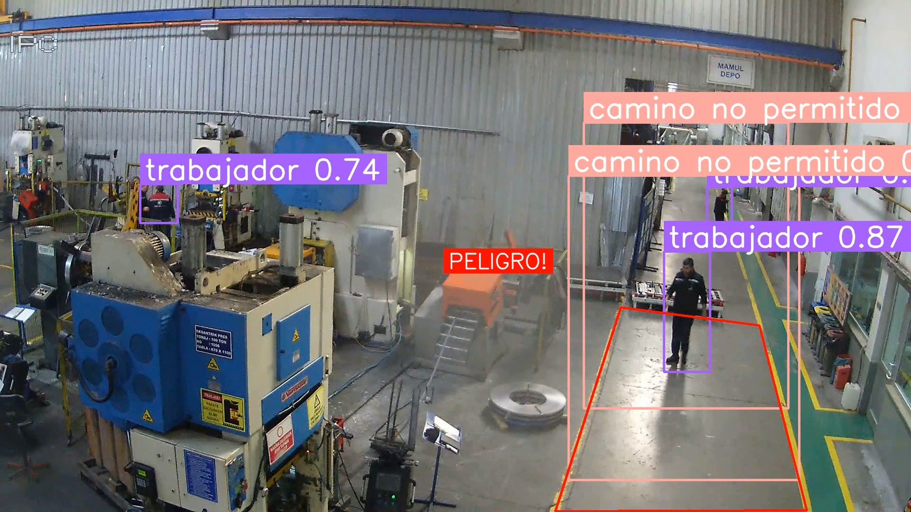

# Detección de Colisiones en Zonas de Riesgo con YOLO

Este proyecto está orientado a la detección de personas(trabajadores) entrando a zonas de riesgo, asi como intervenciones no autorizadas a maquinas especificadas en entornos laborales, utilizando un modelo personalizado basado en redes neuronales entrenado con el algoritmo YOLO. 

El objetivo es mejorar la seguridad en el lugar de trabajo mediante la detección automática de comportamientos inseguros.

## Descripción del Proyecto

El proyecto implementa un sistema de detección que identifica personas que ingresan en zonas peligrosas definidas en un área de trabajo. Utilizando el modelo YOLO entrenado con datos personalizados, el sistema realiza la detección en tiempo real y genera alertas visuales cuando se detecta una violación de seguridad.



### Principales Características

1. **Entrenamiento de un Modelo Personalizado**: Se entrenó un modelo YOLO utilizando un conjunto de datos personalizado, etiquetado para detectar comportamientos seguros e inseguros en el lugar de trabajo. El entrenamiento se realizó con imágenes extraídas de videos reales en entornos laborales.

2. **Anotación de Clases**: Se utilizó la herramienta en línea [CVAT](https://www.cvat.ai/) para anotar las clases de personas y zonas de riesgo. Las imágenes fueron extraídas de videos mediante scripts personalizados para garantizar una representación adecuada en el entrenamiento del modelo.

3. **Detección en Tiempo Real**: El sistema detecta y visualiza las interacciones entre personas y zonas de riesgo en tiempo real, activando alertas cuando una persona ingresa en una zona peligrosa.

4. **Cambio de Perspectiva**: Se aplicaron técnicas de transformación de perspectiva usando OpenCV para adaptar la vista de las cámaras de seguridad, solo como practica.

### Uso de Herramientas y Librerías

- **YOLOv8**: Algoritmo de detección de objetos utilizado para el modelo personalizado.
- **CVAT**: Plataforma en línea utilizada para la anotación de datos.
- **OpenCV**: Librería utilizada para la manipulación de imágenes y el cambio de perspectiva.
- **NumPy**: Para operaciones matemáticas en matrices y procesamiento de datos.

## Datasets Utilizados

- [Worker Safety Dataset](https://universe.roboflow.com/computer-vision/worker-safety): Un conjunto de datos diseñado para la detección de comportamientos seguros e inseguros en entornos de trabajo.
- [Video Dataset for the Detection of Safe and Unsafe Behaviours in Workplaces](https://www.sciencedirect.com/science/article/pii/S235234092400756X): Conjunto de datos de video utilizado para entrenar el modelo YOLO para detectar comportamientos en zonas de riesgo.

## Referencias Bibliográficas

Este proyecto se basa en desarrollos previos del algoritmo YOLO y en la investigación sobre detección basada en visión en entornos laborales:

1. **A Review of YOLO Algorithm Developments**  
   [Enlace al artículo](https://www.sciencedirect.com/science/article/pii/S1877050922001363)
   
   Este artículo revisa las evoluciones del algoritmo YOLO y su impacto en el campo de la visión por computadora.

2. **Vision-Based Detection and Visualization of Dynamic Workspaces**  
   [Enlace al artículo](https://www.sciencedirect.com/science/article/abs/pii/S0926580518312706)
   
   Este trabajo explora la detección y visualización de espacios de trabajo dinámicos utilizando métodos de visión por computadora.

## Cómo Ejecutar el Proyecto

1. **Instalación de Dependencias**: Clona este repositorio y asegúrate de instalar las dependencias necesarias. Se recomienda utilizar un entorno virtual para manejar las librerías.

   ```bash   
   git clone https://github.com/EybertMacedo/SafetyModel.git
   cd SafetyModel
   pip install -r requirements.txt
   
2. **Descarga de datos(videos) para entrenamiento**: Descarga los videos de este articulo: https://www.sciencedirect.com/science/article/pii/S235234092400756X y ponlos dentro de la carpeta "data" del proyecto
